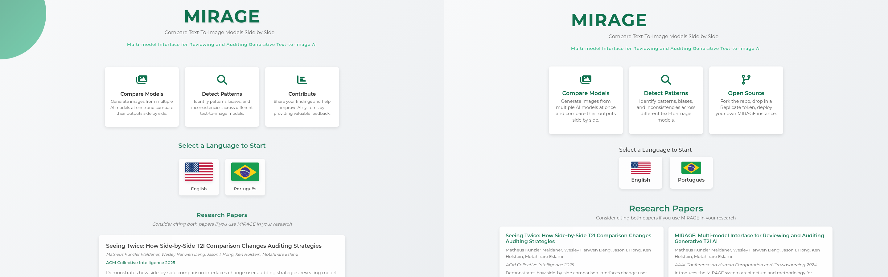
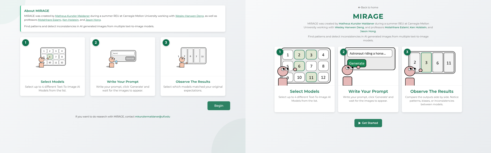
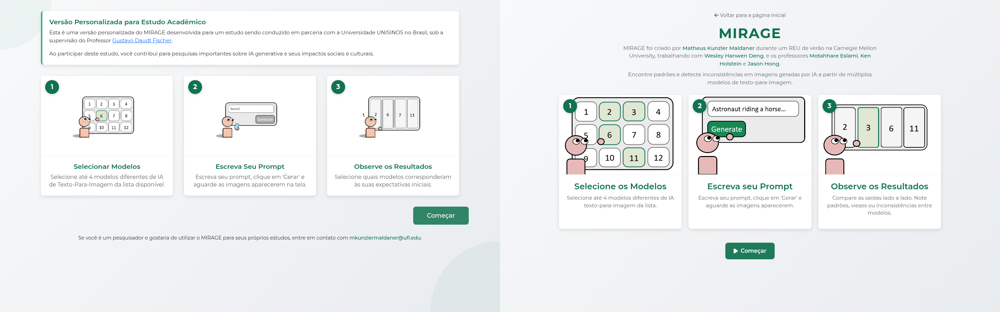
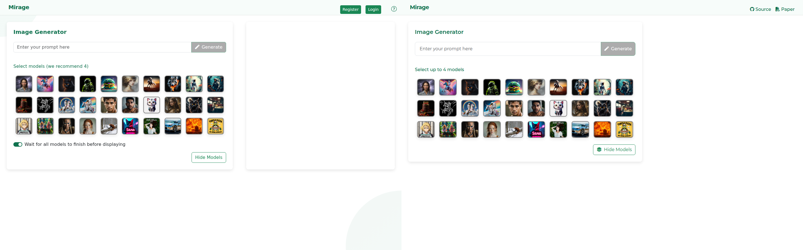

# MIRAGE Parity Audit

Captured on 2026-05-30 at 1440x900. Old pages were rendered from `http://127.0.0.1:8000/` using the Django app in `/home/matheus/projects/CarnegieMellon/WeAudit-Mirage`; new pages were rendered from `https://mirage.matheus.wiki/`.

This report does not treat user accounts, Discourse/forum posting, the three-step report submission flow, DynamoDB session capture, `compare_models_study`, `text_to_image_arena`, dead `_OLD` files, admin, or sitemap as required parity. It does call out wrappers and visual affordances that remain useful after those systems are removed.

## 1. CSS Gaps

### Linked CSS Parity

| Old CSS file | Old loading behavior | New loading behavior | Gap |
| --- | --- | --- | --- |
| `header.css` | Landing loads it (`landing_page.html:14`); EN/PT instructions load it (`instructions_english.html:14`, `instructions_portuguese.html:14`); compare pages inherit it from `base.html:9`. | Only `compare.html:9` and `compare-pt.html:9` load it. | Missing from `index.html`, `instructions.html`, and `instructions-pt.html`. New landing/instructions therefore bypass old root/header variables and typography defaults. |
| `compare_models.css` | Landing and instructions load it (`landing_page.html:15`, instructions line 15); compare pages inherit it (`base.html:10`). | Only compare pages load it (`compare.html:10`, `compare-pt.html:10`). | Missing from `index.html`, `instructions.html`, `instructions-pt.html`. |
| `models_display.css` | Landing and instructions load it (`landing_page.html:16`, instructions line 16); compare pages inherit it (`base.html:11`) and also re-link it in compare templates (`compare_models_english.html:8`, PT line 8). | Only compare pages load it (`compare.html:11`, `compare-pt.html:11`). | Missing from `index.html`, `instructions.html`, `instructions-pt.html`. Present on compare pages. |
| `report_form.css` | Landing and instructions load it (`landing_page.html:17`, instructions line 17); compare pages inherit it (`base.html:12`) and also re-link it in compare templates (`compare_models_english.html:9`, PT line 9). | Not loaded by any new page. | Missing everywhere. This is fine for the Discourse-bound report forms, but it also owned `#input-and-questions-wrapper` and `#form-container`, which the hover model preview used. |
| `landing_page.css` | Landing and instructions load it (`landing_page.html:18`, instructions line 18). Compare pages do not. | Not loaded by any new page. | Missing from `index.html`, `instructions.html`, and `instructions-pt.html`; new pages reimplemented much of it inline. |
| `css/scss/bootstrapmods.css` | Compare pages load it through `base.html:22`; landing/instructions use Bootstrap CDN instead. | Compare pages load it (`compare.html:12`, `compare-pt.html:12`). | OK for compare pages. Not expected on landing/instructions. |

### Inline Style Duplication And Overrides

- `index.html:17-219` is a shortened inline reimplementation of old `landing_page.css` plus the old landing template's large inline block. It is not overriding linked local CSS because no local CSS is linked, but it duplicates the old rules with changed values: smaller flags (`64x40` vs old `90x60`), grid paper layout instead of stacked cards, different feature card spacing, no decorative-circle rules, and no citation modal rules.
- `instructions.html:14-129` and `instructions-pt.html:14-46` reimplement the old instruction-page inline CSS with different selectors (`.container-narrow`, `.intro`, `.primary-btn`) instead of the old `.content-wrapper`, `.main-container`, `.study-info`, `.action-button`, `.researcher-info`, and `.decorative-circle` structure. They also do not load the copied local CSS assets.
- `compare.html:28-111` and `compare-pt.html:28-111` override linked `compare_models.css` and `models_display.css` rules with equal-or-higher cascade order. Affected selectors include `#prompt-submission-container`, `#model-container`, `.model-box`, `.model-box.selected`, `.btn-success`, `.form-control`, `#comparison-results .result`, `#comparison-results .result.highlighted`, `.loading-overlay`, and `.loader`.
- The compare inline overrides change visible old values: old prompt and model containers were green-tinted (`#eff9f5`) with old width/padding rules; new inline rules force white cards and different shadows/padding. Old result cards used 15px radius and stronger border styling; new inline rules reduce to the shared `8px` radius and lighter borders.
- The only new compare-only CSS that is not old-parity styling is `.rate-limit-banner` (`compare.html:100-110`, `compare-pt.html:100-110`). That should stay, because it supports the Cloudflare function.

## 2. HTML Structure Gaps

### `index.html` vs `landing_page.html`

- Missing decorative circles: old has `

` and `.circle-2` at `landing_page.html:584-585`; new landing has none.
- Third feature changed from old `Contribute` with chart-bar icon and feedback copy (`landing_page.html:613-619`) to `Open Source` with code-branch icon and deploy/fork copy (`index.html:240-244`).
- Paper actions are simplified. Old has primary `Read Paper` buttons plus secondary `Copy Citation` buttons (`landing_page.html:653-681`) and a citation modal (`landing_page.html:695-713`). New has only `Read Paper` anchors (`index.html:270-280`) and no modal/copy behavior.
- Paper URLs changed: old CI'25 uses `https://ci.acm.org/2025/wp-content/uploads/101-Maldaner.pdf`; new uses `https://arxiv.org/abs/2511.21547`. Old HCOMP'24 uses `https://www.humancomputation.com/assets/wip_2024/HCOMP_24_WIP_4.pdf`; new uses `https://arxiv.org/abs/2503.19252`.
- Footer changed from `© 2024 MIRAGE | Carnegie Mellon University` (`landing_page.html:689-690`) to GitHub/MIT text (`index.html:286-288`).
- New landing does not link the old local CSS bundle and instead carries its own shorter inline styling.

### `instructions.html` vs `instructions_english.html`

- New page adds a `Back to home` link and large `MIRAGE` heading (`instructions.html:132-135`); old page starts with the `study-info` card and no page header (`instructions_english.html:262-268`).
- Missing old wrappers and decorative elements: `.content-wrapper`, `.main-container`, `.study-info`, `.decorative-circle.circle-1`, `.decorative-circle.circle-2` (`instructions_english.html:257-264`).
- Old uses the GIF assets `mirage-default-gif-1.gif`, `mirage-default-gif-2-faster.gif`, and `mirage-default-gif-3.gif` (`instructions_english.html:274`, `283`, `292`). New uses `onboarding-default-mirage-1/2/3.png` (`instructions.html:143`, `151`, `159`), producing visibly different illustrations.
- Step 3 content changed. Old says users select which models matched expectations (`instructions_english.html:294-295`); new says compare outputs and notice patterns/biases/inconsistencies (`instructions.html:161-162`).
- CTA changed from right-aligned `Begin` (`instructions_english.html:300-303`) to centered `Get Started` with play icon (`instructions.html:167-169`).
- Missing researcher contact footer (`instructions_english.html:307-308`).

### `instructions-pt.html` vs `instructions_portuguese.html`

- Same structure changes as English: new back link/title, no old wrappers, no decorative circles, no `researcher-info`, and PNG assets instead of old GIF assets.
- Major content mismatch: old PT instruction page is the customized academic-study copy, headed `Versão Personalizada para Estudo Acadêmico` and mentioning UNISINOS/Gustavo Daudt Fischer (`instructions_portuguese.html:264-268`). New PT page uses generic MIRAGE creator/about copy (`instructions-pt.html:52-55`).
- Step 3 content changed from selecting which models met expectations (`instructions_portuguese.html:294-295`) to comparing side-by-side and noticing patterns/biases (`instructions-pt.html:78-79`).
- CTA changed from old `Começar` styled as `.action-button` (`instructions_portuguese.html:300-303`) to new `.primary-btn` with play icon (`instructions-pt.html:84-86`).

### `compare.html` vs `compare_models_english.html`

- Header root IDs are retained (`#header`, `#logo-WeAudit`), but the right side is different. Old has auth buttons plus question icon in `base.html:37-68`; new has `Source` and `Paper` links (`compare.html:120-128`). Ignoring auth removal, the help/question icon is still a visual/behavior gap.
- Missing decorative circles from old compare (`compare_models_english.html:272-273`).
- Missing early critical image preloader inline script (`compare_models_english.html:23-54`).
- Missing `#form-container` wrapper (`compare_models_english.html:314`) and the non-report child that matters most: `#model-info`, `#model-name`, `#model-description`, `#model-image-1`, `#model-image-2`, and `#model-info-link` (`compare_models_english.html:317-331`).
- The three report forms and report buttons are removed. That is intentionally allowed, but the old visual right column also hosted model hover information, so dropping the whole wrapper removed more than the Discourse flow.
- Missing `#waitForAllModelsCheckbox` toggle (`compare_models_english.html:299-304`). This is not account/forum/DB-bound and affects visible generation behavior.
- Tutorial modal is missing (`compare_models_english.html:428-486`). For parity, it should come back as a static first-visit modal; if the standalone intentionally wants less friction, it can remain removed, but it is a parity gap.
- Image preview modal is retained (`compare.html:169-182` vs old `compare_models_english.html:408-420`).
- Loading overlay is retained, but the visible text changed from `Loading Images...` (`compare_models_english.html:423-425`) to `Generating Images...` (`compare.html:184-186`).
- No footer existed on old compare pages, so there is no footer gap here.

### `compare-pt.html` vs `compare_models_portuguese.html`

- All English compare gaps apply.
- Old PT has additional demographics modal HTML and first-visit flow (`compare_models_portuguese.html:467-644`, JS around `compare_models_portuguese.js:202-269`). New PT has none. If this is considered study data capture, keep it removed; if strict PT parity is the goal, it is a visible first-visit gap.
- Old PT imports Portuguese hover descriptions through `translations_pt.js` (`compare_models_portuguese.js:1-2`, `translations_pt.js:1-26`); new compare has no hover panel, so those translations are unreachable.
- New PT header still shows English `Source` and `Paper` (`compare-pt.html:121-128`), and the modal close button has `aria-label="Close"` (`compare-pt.html:174`).

## 3. JS Behavior Gaps

### Retained Or Partly Retained

- Basic model selection with `MAX_MODELS = 4` is retained in `js/compare.js:39-67`.
- Click-to-highlight result rows is retained (`js/compare.js:171`), but old also enabled/disabled the report button when highlight state changed (`compare_models_english.js:472-490`). That second part is gone with the report flow.
- Image modal preview is retained (`js/compare.js:173-179`), now using Bootstrap's JS API instead of jQuery (`compare_models_english.js:493-499`).
- The aggressive multi-batch model-image preloader is mostly retained because `js/constants.js` is still copied from old and still calls `preloadModelImages()` on load (`constants.js:503-586`, with only fallback image changes). What is missing is the compare template's early critical-image preloader in the `<head>` (`compare_models_english.html:23-54`) and the hover-panel image preloading tied to `#model-info`.

### Lost Or Simplified

- Model hover preview is gone. Old attaches `mouseenter`/`mouseleave` to every `.model-box` (`compare_models_english.js:89-105`) and fills `#model-info` with name, description, images, and link (`compare_models_english.js:157-205`). New only attaches click handlers (`js/compare.js:39-67`).
- Portuguese model descriptions are gone from the UI. Old PT uses `PORTUGUESE_DESCRIPTIONS` in hover info (`compare_models_portuguese.js:296-351`); new has no import and no hover panel.
- Prompt state behavior regressed. Old enables `Generate` only when a model is selected and the prompt is non-empty (`compare_models_english.js:241-253`) and listens to prompt input plus Enter (`compare_models_english.js:108-124`). New enables `Generate` as soon as a model is selected (`js/compare.js:69-78`) and only alerts if the prompt is empty at click time (`js/compare.js:92-100`).
- Visual lockout during generation is simplified. Old disables the prompt input and adds `.disabled` to model boxes (`compare_models_english.js:295-304`); new only sets an internal `modelSelectionEnabled = false` and leaves the UI looking interactive (`js/compare.js:103-119`).
- Local session state is removed: `modelUsageCounts`, `modelMatchCounts`, `sessionData`, request ID, `mirage_session_data`, session history, and demographic storage (`compare_models_english.js:8-20`, `327-352`, `640-654`, `849-863`; PT also `compare_models_portuguese.js:23-27`, `202-269`). DynamoDB capture can stay removed, but local-only session affordances are gone.
- Wait-vs-stream branch is removed. Old reads `#waitForAllModelsCheckbox` (`compare_models_english.js:126-130`) and then either waits for all promises or displays models as they complete (`compare_models_english.js:544-600`, `checkModelStatusPeriodically` at `391-433`). New always waits for all selected model fetches to settle before hiding the overlay (`js/compare.js:109-119`).
- Backend flow changed from AWS fire-and-poll (`compare_models_english.js:357-433`) to one synchronous Cloudflare endpoint per model (`js/compare.js:122-149`). That backend rewrite is expected, but it also removes visible streaming unless reintroduced around the new endpoint.
- Report button/form state transitions are removed (`startInitialReport`, `submitInitialReport`, `startSecondReport`, `submitSecondReport`, `startThirdReport`, `resetPage`; old `compare_models_english.js:507-864`). The Discourse-bound forms should stay removed, but the old result lifecycle and reset behavior disappeared with them.
- First-visit tutorial modal behavior is removed (`compare_models_english.html:428-486`, PT modal at `compare_models_portuguese.html:647-692`).
- New adds a Cloudflare rate-limit banner (`js/compare.js:201-213`), which is a good standalone addition and should stay.

## 4. Portuguese Parity

- `compare-pt.html` is not structurally equivalent to old `compare_models_portuguese.html`: old PT template is 839 lines and includes hover preview, wait toggle, report form shells, image modal, loading overlay, demographics modal, and tutorial modal. New PT is 192 lines and keeps only prompt/model selection, result container, image modal, loading overlay, and rate-limit banner.
- PT hover descriptions are not reachable because `translations_pt.js` is not used by new `js/compare.js`.
- Not every user-visible string on PT compare is translated:
  - `Source` and `Paper` remain English in the header (`compare-pt.html:123`, `127`).
  - `aria-label="Close"` remains English (`compare-pt.html:174`).
  - Generated image alt text is English in shared JS: `Generated output for ... Image ...` (`js/compare.js:162`).
  - Developer-facing error text includes `api error` and `rate limit` internals (`js/compare.js:139`, `144`, `187`) if surfaced through `Geração falhou`.
- PT instructions cover all three steps, but not with old parity:
  - Old PT study intro is replaced by generic MIRAGE intro.
  - Old step 3 says users select which models matched expectations; new says users compare outputs and notice patterns/biases.
  - Old researcher contact is missing.
  - Old GIFs are replaced by PNG onboarding images.

## 5. Side-By-Side Screenshots

Left side is old Django. Right side is new live deploy.

### Landing

Visible gaps: old decorative circles are visible and new has none; new content sits with different vertical rhythm; feature 3 changed from `Contribute` to `Open Source`; flags are smaller; paper cards changed from stacked/wide cards with citation buttons to two-column cards with only `Read Paper`; old CMU footer text is not preserved.

### English Instructions

Visible gaps: old starts with an `About MIRAGE` card, new starts with a back link and large logo; old has floating decorative circles, new does not; old uses the default MIRAGE GIFs, new uses different onboarding PNGs; old button is right-aligned `Begin`, new is centered `Get Started`; old researcher contact footer is missing.

### Portuguese Instructions

Visible gaps: old PT page is the academic-study/UNISINOS version; new PT page is generic about MIRAGE; old decorative circles and researcher contact are gone; image assets and step 3 copy changed; layout and CTA treatment differ in the same way as English.

### English Compare

Visible gaps: old header has auth/help controls while new has Source/Paper; old has the right-side `#form-container` card reserved for hover model info, new has no right panel; old has `Wait for all models to finish before displaying`, new does not; old has decorative circle background, new does not; new prompt card is shorter because the wait toggle and right wrapper are gone.

### Portuguese Compare

Visible gaps: same compare gaps as English; new PT header still shows English `Source`/`Paper`; old wait toggle and right-side hover-info column are missing; old PT first-visit demographics/tutorial behavior is not visible because localStorage was set before screenshot, but the underlying HTML/JS exists only in old.

## 6. Concrete Change List

1. `index.html`: link `css/header.css`, `css/compare_models.css`, `css/models_display.css`, `css/report_form.css`, and `css/landing_page.css` in `<head>` like old `landing_page.html:14-18`.
2. `css/landing_page.css`: update copied static URLs from `/static/mirage/images/flag-us.png` and `/static/mirage/images/flag-br.png` to static-standalone paths such as `../images/flag-us.png` and `../images/flag-br.png`.
3. `index.html`: remove the inline `<style>` block at lines 17-219 after the linked CSS is restored, keeping only static-standalone path fixes if needed.
4. `index.html`: re-add `

` and `.circle-2` before `.landing-container`, matching old `landing_page.html:584-585`.
5. `index.html`: restore the old third feature content (`Contribute`) unless the open-source positioning is intentionally replacing old landing copy.
6. `index.html`: restore paper card structure with `Copy Citation` buttons and the citation modal/script from old `landing_page.html:653-843`; keep new open-source/deploy links elsewhere in the README or footer.
7. `instructions.html` and `instructions-pt.html`: link the same five old CSS files that old instructions loaded (`instructions_english.html:14-18`, `instructions_portuguese.html:14-18`) and remove the new page-local style blocks.
8. `instructions.html`: restore old `.content-wrapper`, `.main-container`, `.study-info`, `.steps-container`, `.action-button`, and `.researcher-info` structure from `instructions_english.html:257-309`.
9. `instructions.html`: use `images/mirage-default-gif-1.gif`, `images/mirage-default-gif-2-faster.gif`, and `images/mirage-default-gif-3.gif` instead of `onboarding-default-mirage-*.png`.
10. `instructions-pt.html`: decide whether standalone PT should preserve the old UNISINOS study copy. If strict old PT parity is desired, restore `instructions_portuguese.html:264-308`; if not, still restore the old layout, GIFs, decorative circles, step 3 wording, and researcher contact.
11. `compare.html` and `compare-pt.html`: add `<link rel="stylesheet" type="text/css" href="css/report_form.css">` in the head next to the other old CSS links.
12. `compare.html` and `compare-pt.html`: remove the broad inline restyle blocks at lines 28-111. Keep only `.rate-limit-banner` styles or move them into a small standalone CSS file.
13. `compare.html` and `compare-pt.html`: re-add decorative circles before `#input-and-questions-wrapper`, matching old compare templates.
14. `compare.html` and `compare-pt.html`: re-add `#form-container` with only the `#model-info` preview subtree (`#model-name`, `#model-description`, `#model-image-1`, `#model-image-2`, `#model-info-link`). Do not re-add the Discourse-bound report forms unless intentionally restoring research flow.
15. `compare.html` and `compare-pt.html`: re-add `#waitForAllModelsCheckbox` and label. It is backend-agnostic and controls visible result timing.
16. `compare.html` and `compare-pt.html`: re-add the first-visit tutorial modal as static HTML/localStorage behavior if parity is the goal.
17. `compare.html` and `compare-pt.html`: restore the early critical-image preloader script from old compare templates (`compare_models_english.html:23-54`) or explicitly document that `constants.js` batch preloading is the only retained preloader.
18. `js/compare.js`: add prompt input listeners so the Generate button only enables when at least one model is selected and the prompt is non-empty, matching old `compare_models_english.js:108-124` and `241-253`.
19. `js/compare.js`: re-add model hover behavior from old `compare_models_english.js:89-105` and `157-205`; for PT, import `translations_pt.js` and use old `compare_models_portuguese.js:296-351`.
20. `js/compare.js`: re-add the wait-vs-stream display branch around the Cloudflare endpoint. Keep the new `/api/generate` backend call, but let unchecked mode display each model as its promise resolves.
21. `compare-pt.html` and `js/compare.js`: translate remaining PT strings: `Source`, `Paper`, close labels, generated image alt text, and surfaced error/rate-limit internals.
22. `README.md`: keep the new README banner and explicit anchors for deployed software plus CI'25/HCOMP'24 papers.
